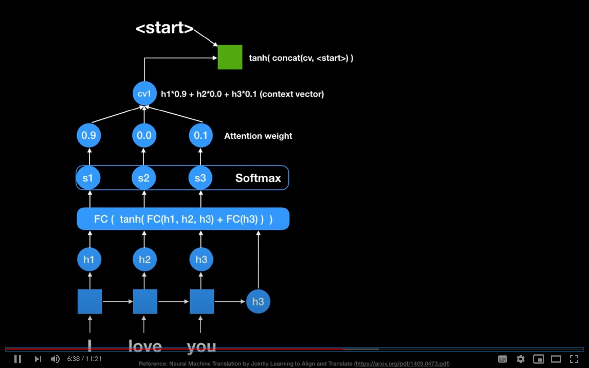
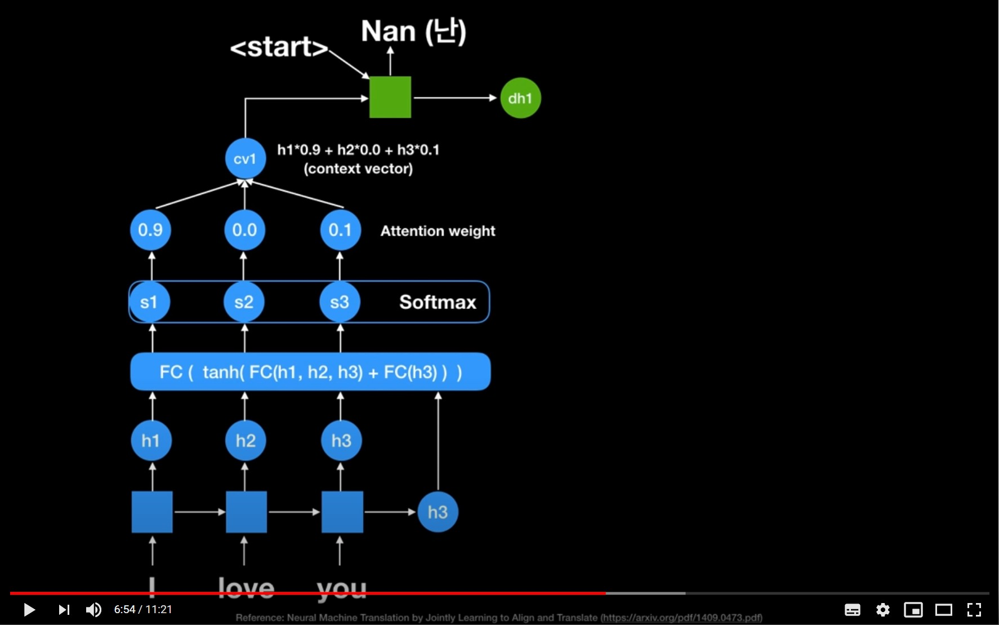
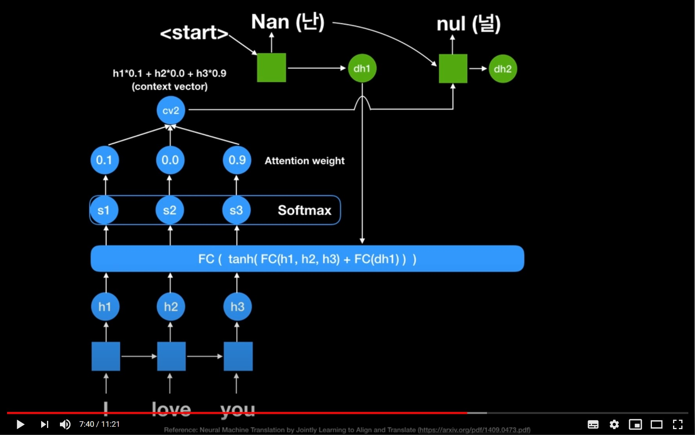
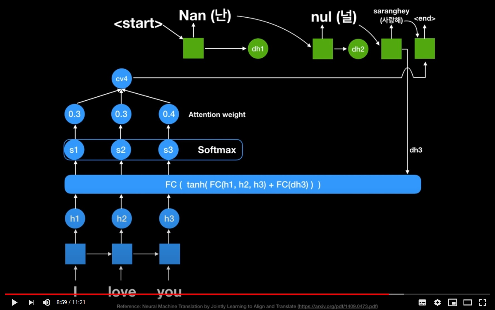
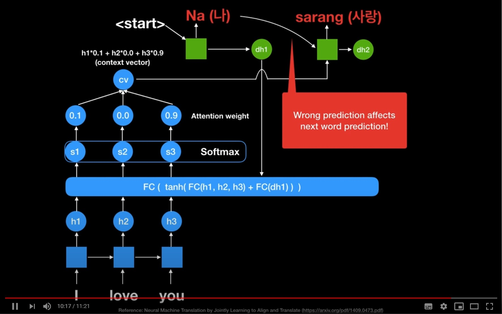
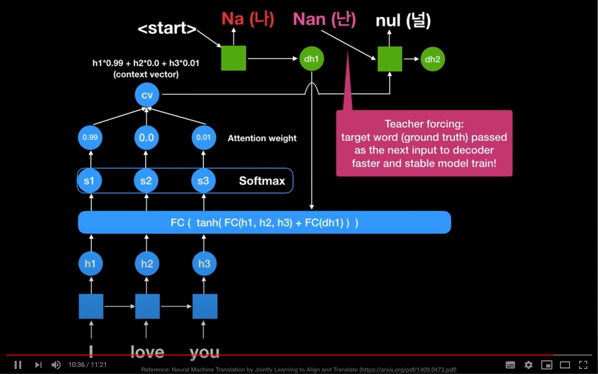

## Word Embedding

자연어를 좌표평면 위에 표현하는 방식으로 단어의 의미가 벡터로 표현됨.
반면, `one-hot encoding` 방식(Sparse Represientation - 낮은 밀도의 표현 방식). one-hot encoding은 단어 벡터가 sparse해서 단어가 가지는 *의미*는 벡터 공간에서 표현 불가능.

**Sparse Representation**
* `One-hot encoding`
* n개 단어의 n차원 벡터
* 의미유추 불가능

**Dense Representation**
* Word Embedding
* 한정된 차원으로 표현 가능
* 의미 관계 유추 가능
* 비지도 학습으로 단어의 의미 학습 가능

----

### Word2Vec

대표적인 방법은 `Skip-gram`방식. 주변부의 단어를 예측하는 방식으로 학습한다. 따라서 단어에 대한 dense vector를 얻을 수 있다.

**장점** 
* 단어간의 유사도 측정에 용이
* 단어간의 관계파악 용이
* 벡터 연산을 통한 추론 가능

**단점**
* 단어의 subword information 무시(**서울** vs **서울**시 vs 고양**시**)
* Our of vocabulary(OOV)에서 적용 불가능

### FastText

한국어에서 Word2Vec의 경우 다양한 용언 표현들이 서로 독립된 vocab으로 관리. 따라서 기존의 word2vec과 유사하나 단어를 `n-gram`형태로 나누어 학습을 수행. n-gram으로 나눠진 단어는 사전에 들어가지 않으며, 별도의 n-gram vector를 형성함.

**FastText**는 단어를 `n-gram`으로 분리한 후 모든 n-gram vector를 합산, 평균을 통해 단어 벡터를 흭득.

> Word Embedding 방식의 한계점
> * 동형어, 다의어 등에 대해선 embedding 성능이 좋지 못하다는 단점이 있음.
> * 주변 단어를 통해 학습이 이루어지기 때문에, `문맥`을 고려할 수 없음.

----

## Language Model
'자연어'의 법칙을 컴퓨터로 모사한 모델로 주어진 단어들로부터 그 **다음에 등장한 단어의 확률을 예측**하는 방식으로 학습한다. 다음의 등장할 단어를 잘 예측하는 모델은 그 **언어의 특성이 잘 반영된 모델**이자, **문맥**을 잘 계산하는 좋은 언어 모델이다.

### **Markov Chain Model**
첫 번째 단어가 오면 vocab중 그 다음에 올 단어의 가능성을 구하는 방식.
* 확률 기반의 언어 모델
* 초기 언어 모델은 다음의 단어나 문장이 나올 확률을 통계와 단어의 n-gram을 기반으로 계산
* 딥러닝 기반의 언어모델은 **해당 확률을 최대로 하도록 네트워크를 학습**

### **RNN Model**
이전 state 정보가 다음 state를 예측하는데 사용됨으로써, 시계열 데이터 처리에 특화. 마지막 출력은 앞선 단어들의 `문맥`을 고려해서 만들어진 최종 출력 vector -> Context vector. 출력된 context vector 값에 대해 classification layer를 붙이면 문장 분류를 위한 신경망모델이 된다.

### **Seq2Seq Model**

Seq2Seq 모델은 Encoder layer와 Decoder layer, Context vector로 이루어진다. 

* Seq2Seq : Sequence to Sequence.
* Encoder layer : RNN 구조에서 각 단어를 순차적으로 받아 Context vector 제작.
* Decoder layer : 획든된 Context vector를 input으로 하여 기계번역 시작.
* Contet vector : Incoder RNN cell의 마지막 시점 hidden state. Decoder RNN cell의 첫 번째 input hidden state로 context vector를 사용.

seq2seq은 training 과 test의 작동방식이 조금 다르다. training 할 때는 `<sos>` i love you를 입력받았을 때 i love you`<eos>`가 나와야 된다고 정답을 알려주며 훈련하고 test 할 때는 context 벡터와 `<sos>`만을 입력받은 후에 다음에 올 단어를 예측한다.
So, decoder는 context vector(incoder 마지막 RNN cell의 hidden state)와 `<sos>`를 입력값으로 다음에 올 단어 예측을 시작한다.

> RNN의 구조적 문제점
> * 입력 Sequence의 길이가 매우 긴 경우, 처음에 나온 token에 대한 정보가 희석
> * 고정된 context vector 사이즈로 인해 긴 Sequence에 대한 정보를 함축하기 어려움
> * 모든 token이 영향을 미치니, 중요하지 않은 token도 영향을 줌.

### **Attention Model**
중요한 Feature는 더욱 중요하게 고려하는 것이 Attention의 모티브. 기존 Seq2Seq에서는 RNN의 최종 output인 Context vector만을 활용했지만, Attention에서는 인코더 RNN셀의 각각 output을 활용한다. Decoder에서는 매 step마다 RNN셀의 output을 이용해 dynamic하게 Context vector 생성하여 다음에 올 단어를 예측한다.

**[작동 원리]**

만약 잘못된 정보를 예측했을 경우 next cell의 input을 잘못된 정보가 아닌 올바른 정보를 넣어주어 학습속도와 정확도를 더 높여준다.

참조 : [[딥러닝 기계번역] 시퀀스 투 시퀀스 + 어텐션 모델](https://www.youtube.com/watch?v=WsQLdu2JMgI)

> Attention model은 seq2seq의 encoder, decoder의 성능을 크게 향상시키며 attention weight로 인한 dynamic context vector를 획득했다. 다만, 여전히 RNN이 순차적으로 연산이 이루어짐에 따라 **연산 속도가 느리다.**

### **Transformer Model**
attention model에서 RNN을 제거하고 데이터를 병렬화함에 따라 더 빠른 학습이 가능하다.

#### **Self-Attention, Multi Head Attention**

`Self-Attention`은 Encoder에서 이루어지는 연산으로 자기 자신을 잘 표현하는 attention을 구하는 것이 목표다.
input 문장의 token을 3종류의 vector(Query, Key, Value)로 나타낸다.

현재 단어는 query, 어떤 단어의 key값을 곱해서 attention score를 구한다. 그다음 softmax에 value를 곱해서 최종적인 벡터를 구한다.

단어임베딩이 벡터이므로 입력 문장 전체는 행렬로 표시할 수 있다. 이 모든 단어에 대한 attention 연산을 한번에 행렬곱으로 처리할 수 있다. 이것이 바로 attention을 사용한 병렬처리의 장점이다. 이 병렬처리에 대한 Attention layer를 `Multi Head Attention`이라고 한다.
> 여기까지 https://www.youtube.com/watch?v=mxGCEWOxfe8 10분 10초